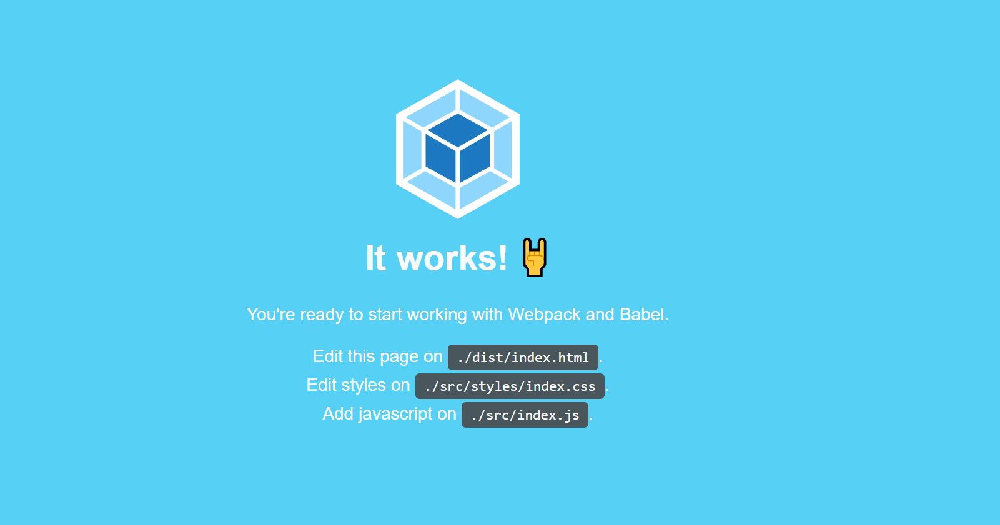

## Desenvolvido por [Arthur Mendes Cunha](https://github.com/mendesarthur)

# Projeto webpack

### Projeto usando webpack 5 e babel js.

# Iniciar🚀

 Para inciar o projeto, é so executar o comando `npm run dev` no terminal.

